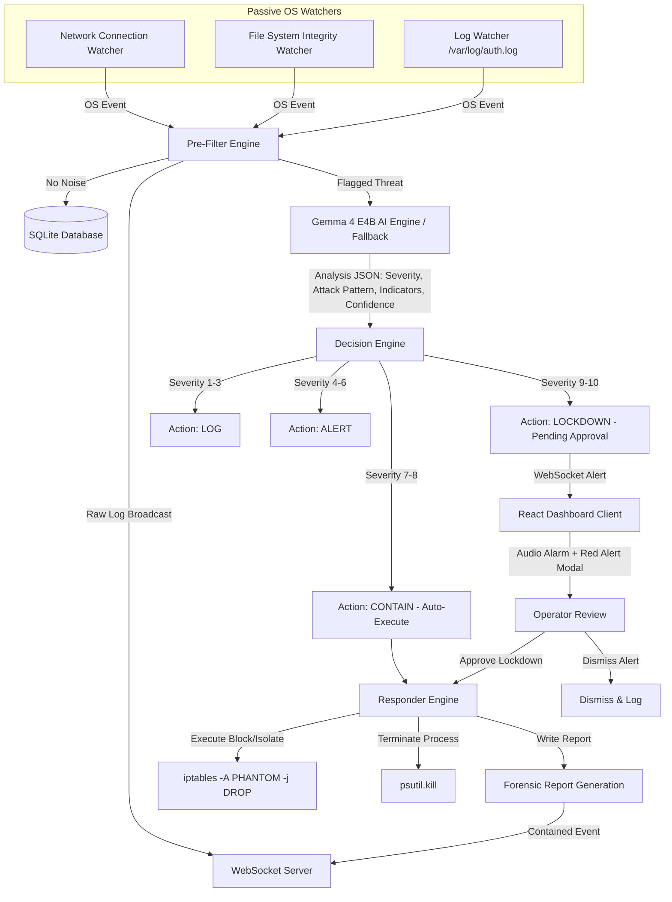

# 🛡️ PhantomAgent

> **Autonomous AI-Powered Security Operations Dashboard**  
> Real-Time Network Watchers • Local Gemma 4 E4B Threat Classification • Autonomous Containment Pipeline • Retro Cyber-Themed React Frontend

---


---

## 📖 Overview

**PhantomAgent** is an autonomous security operations center (SOC) dashboard. It integrates real-time OS-level watchers (network socket activity, file system integrity, and login/syslog auditing) with a local AI-driven decision engine to detect, classify, and mitigate cyber threats dynamically.

Built with a high-performance **FastAPI** backend and a responsive, retro-cyber **React** frontend, it visualizes the entire threat lifecycle from detection to auto-containment or human-in-the-loop approval. 

---

## 🏗️ Architecture & Pipeline Lifecycle

PhantomAgent operates as a multi-stage security pipeline. Events are passively gathered by OS-level watchers, passed through a rule-based pre-filter to drop background noise, analyzed by a local instance of the **Gemma 4 E4B** LLM (running via **llama.cpp**), and routed by a decision engine based on severity thresholds.



### ⚡ The Threat Pipeline Stages

| Stage | Process Name | Description |
| :--- | :--- | :--- |
| **Stage 0** | **Detection Watchers** | System-level loops monitoring auth logs, folder changes, and live network sockets. |
| **Stage 1** | **Pre-Filter Engine** | Deterministic rule matching to filter out background operating system noise. |
| **Stage 2** | **Gemma AI Classifier** | Interrogates local **llama.cpp** using the `gemma-4-e4b` model to parse logs, map to attack patterns, and score confidence. |
| **Stage 3** | **Decision Engine** | Routes action pathways based on severity metrics: Log, Alert, Contain, or Lockdown. |
| **Stage 4** | **Containment Responder** | Invokes mitigation scripts (IP blocking, process termination, folder locking) and compiles forensic case files. |

---

## ✨ Features

*   🔴 **Real-Time Threat Feed**: Live WebSocket streaming of incoming security events with severity badges and expandable detail cards.
*   🗺️ **Interactive Attack Map**: Visualizes the source IP geolocation of threats with animated vectors tracing back to the target host.
*   ⚡ **MITRE ATT&CK Kill Chain**: Highlighting the active status of the pipeline as an event travels from detection to containment.
*   🌐 **Live Connections Panel (New)**: Passive TCP port monitoring tracking active sockets, direction (inbound/outbound), and socket states directly on the host machine.
*   🚨 **Red Alert Intervention**: Glitch CRT scanline overlays, Matrix hex code screens, and auto-escalating approval count-downs for Critical (Severity 9+) incidents.
*   🔊 **Audio Alarms**: High-pitch acoustic alarms that ring on Severity 9+ alerts (safely unlocking through standard browser user action handling).
*   📄 **Forensic Incident Auditing**: Auto-generated markdown reports containing the target profile, incident timelines, specific observable indicators, and remediation suggestions.
*   🔐 **CRT Login Security**: Retro console credential verification interface complete with animated boot logs and fallback focus configurations.

---

## 🛠️ Tech Stack

### Backend
*   **FastAPI**: Asynchronous web frameworks handling HTTP endpoints and WebSocket routing.
*   **SQLite**: Local database persistent repository for threat metrics and system-level events.
*   **llama.cpp (Gemma 4 E4B)**: Offline artificial intelligence reasoning for explaining and parsing raw logs.
*   **psutil & Watchdog**: Local machine packet counting, socket mapping, and file folder integrity auditing.

### Frontend
*   **React 18 & Vite**: Fast development server and modular architecture.
*   **Tailwind CSS v4**: Theme styling utilizing dark-space neon colors.
*   **Framer Motion**: Smooth component entry transitions, slide-outs, and indicator pulses.
*   **Lucide React**: Clean vector indicators.

---

## 🚀 Installation & Quick Start

### Prerequisites
*   Python 3.10+
*   Node.js 18+
*   npm or yarn
*   llama.cpp (Optional, for offline AI classification)

### 1. Clone the Repository
```bash
git clone https://github.com/yourusername/phantomagent-dashboard.git
cd phantomagent-dashboard
```

### 2. Configure llama.cpp & Gemma 4 E4B (Optional)
To run local AI classification, configure **llama.cpp** and download the Gemma 4 E4B GGUF model:
```bash
# Start your llama.cpp server with the Gemma 4 E4B model
./llama-server -m gemma-4-e4b-it.Q4_K_M.gguf -c 4096 --port 8085
```
> [!NOTE]  
> If the llama.cpp server is offline or the model is missing, the backend seamlessly routes threat logs to a rule-based fallback classification matrix without failing.

### 3. Backend Deployment
Initialize the Python virtual environment and run the main application:
```bash
cd backend
python -m venv venv
source venv/bin/activate  # On Windows: venv\Scripts\activate
pip install -r requirements.txt
```
Start the backend watchers and API server from the workspace root:
```bash
cd ..
python run.py
```
> [!IMPORTANT]  
> The backend runs on `http://localhost:8000`. Watchers will attempt to monitor directories specified in the configuration file.

### 4. Frontend Deployment
Run the React development server:
```bash
cd frontend
npm install
npm run dev
```
Open `http://localhost:5173` inside your browser.

**Operator Credentials:**
*   **Username**: `admin`
*   **Password**: `phantom`

---

## 🧪 Simulation & Testing

To validate the dashboard pipeline, you can inject simulated attacks targeting the REST endpoint. Open a secondary terminal and execute the following cURL calls:

### 1. DNS Tunneling (Severity 9 - Manual Approval Required)
```bash
curl -X POST http://localhost:8000/api/test/inject
```
*   **Behavior**: Triggers the **Red Alert Modal**, plays the critical alarm, and requires the operator to click `APPROVE` or `DISMISS`.

### 2. Malicious Payload Dropped (Severity 7 - Auto-Containment)
```bash
curl -X POST http://localhost:8000/api/test/inject-auto
```
*   **Behavior**: Automated rules run immediately. The IP is blocked, threat stats increment, and a forensic report is saved.

### 3. Lateral Movement Activity (Severity 8 - Auto-Containment)
```bash
curl -X POST http://localhost:8000/api/test/inject-lateral
```
*   **Behavior**: Simulates credential misuse by RDP-ing off-hours. Immediately auto-contains.

### 4. Ransomware Execution (Severity 10 - Critical Approval Required)
```bash
curl -X POST http://localhost:8000/api/test/inject-ransomware
```
*   **Behavior**: Simulates mass encryption. Triggers immediate red alert with high priority status.

---

## 📂 Project Structure

```
phantomagent-dashboard/
├── backend/
│   ├── api/                    # HTTP route controllers
│   ├── ai/
│   │   └── classifier.py       # (Legacy) Threat classification
│   ├── data/                   # Dynamic runtime files (Reports, SQLite)
│   │   └── phantomagent.db     # Main threat & log database
│   ├── models/
│   │   └── threat.py           # SQL/Pydantic schemas for events
│   ├── pipeline/
│   │   ├── decision_engine.py  # Score router based on severity
│   │   ├── prefilter.py        # Log sanitizer and denoiser
│   │   ├── qwen_engine.py      # Ollama/Qwen 3.5 query builder
│   │   └── responder.py        # Containment execution script (iptables)
│   ├── utils/                  # Helper classes
│   ├── watchers/
│   │   ├── file_watcher.py     # File modification listener
│   │   ├── log_watcher.py      # Auth and syslog tail monitor
│   │   └── network_watcher.py  # Socket listeners via psutil
│   ├── config.py               # Main path & system configuration
│   ├── database.py             # SQLite query layer
│   ├── main.py                 # FastAPI engine and WebSocket loop
│   └── requirements.txt        # Backend dependencies
├── frontend/
│   ├── src/
│   │   ├── components/
│   │   │   ├── AttackMap.jsx         # D3/Map GL geolocator
│   │   │   ├── AuthorityBar.jsx      # Global status header
│   │   │   ├── KillChain.jsx         # Pipeline animation component
│   │   │   ├── LiveConnections.jsx  # Active sockets monitoring panel
│   │   │   ├── LoginPage.jsx         # Terminal boot authentication
│   │   │   ├── ParticleBurst.jsx     # Fireworks/burst containment animation
│   │   │   ├── RedAlertModal.jsx     # Glitch operator verification
│   │   │   ├── TerminalStream.jsx    # Console typewriter log streams
│   │   │   └── ThreatFeed.jsx        # WebSocket alert tracker
│   │   ├── context/
│   │   │   └── DashboardContext.jsx  # Socket subscriber context provider
│   │   ├── hooks/
│   │   │   └── useTypewriter.js      # Text typing speed effect hook
│   │   ├── services/
│   │   │   ├── geoService.js         # IP location lookup API client
│   │   │   └── websocket.js          # WS subscription listener
│   │   ├── App.jsx                   # Component layout builder
│   │   └── index.css                 # Tailwind directives + Cyber animations
│   ├── package.json                  # Frontend scripts & modules
│   └── vite.config.js                # Vite build configuration
├── run.py                            # Unified application runner script
└── test_event.py                     # Legacy simulation script
```

---

## 🔧 System Configuration

Systems settings can be customized in the config file at [backend/config.py](file:///home/tarun/phantomagent-dashboard/backend/config.py):

```python
# System Logging Watchers
WATCHED_LOGS = ["/var/log/auth.log", "/var/log/syslog"]

# Active Network Audits
NETWORK_INTERFACE = "eth0"
PORT_SCAN_THRESHOLD = 20

# Directory Protection Integrity
WATCHED_PATHS = ["/tmp", "/var/tmp"]

# Local llama.cpp AI Settings
MODEL_NAME = "gemma-4-e4b"
API_URL = "http://localhost:8085/completion"
TIMEOUT = 30  # Seconds
```

---

## 🎨 Theme Styling & Visual Assets

### Custom Tailwind v4 Variables
```css
@theme {
  --color-deep-space: #050508;     /* Space background color */
  --color-panel-base: #0a0a12;     /* Card background color */
  --color-panel-border: #1a1a2e;   /* Cyber-styled grid borders */
  --color-neon-cyan: #00f0ff;      /* UI action highlights */
  --color-alert-red: #ff2a2a;      /* Red alert signals */
  --color-contain-green: #00ff88;  /* Success and containment colors */
  --color-warning-amber: #ffaa00;  /* Moderated warnings */
}
```

### Dynamic Animations (in `index.css`)
*   **Glitch Overlay**: Simulates high-voltage interference during a Severity 9+ threat.
*   **Radar Pulse**: Cyclic breathing green indicators validating active socket connections.
*   **Typewriter typing**: Smooth console feed updates.

---

## 🐛 Troubleshooting

*   **`405 Method Not Allowed` when injecting events**:  
    Make sure to send a `POST` request, not a `GET` request. Example: `curl -X POST http://localhost:8000/api/test/inject`.
*   **`llama.cpp server not responding`**:  
    Ensure you have started your llama.cpp server: `./llama-server -m gemma-4-e4b-it.Q4_K_M.gguf -c 4096 --port 8085`.
*   **`iptables: Permission denied` on containment**:  
    IP blocking requires root permissions (`sudo`). If running without privileges, the responder logs a warning and uses a mock container.
*   **Browser blocked the audio alarm**:  
    Modern browsers block audio before the first user interaction. Click anywhere on the login page or dashboard to enable audio permissions.

---

## 🙏 Credits

*   [Tailwind CSS v4](https://tailwindcss.com) for structural styling
*   [Framer Motion](https://www.framer.com/motion/) for animations
*   [FastAPI](https://fastapi.tiangolo.com) for real-time endpoints
*   [llama.cpp](https://github.com/ggerganov/llama.cpp) and [Google Gemma](https://ai.google.dev/gemma) for the local classification engine

---

> *"In cyberspace, the best defense is an autonomous offense."* — **PhantomAgent**
